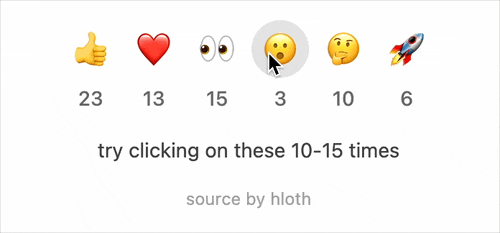

# pow-reaction

[](https://github.com/VityaSchel/pow-reaction/blob/main/LICENSE)
[](https://www.npmjs.com/package/pow-reaction)
[](https://www.npmjs.com/package/pow-reaction)

<!-- [](https://jsr.io/@hloth/pow-reaction) -->

proof-of-work reactions for your Svelte blogs

<picture>
  <source media="(prefers-color-scheme: dark)" srcset="docs/dark-demo.gif">
  <source media="(prefers-color-scheme: light)" srcset="docs/light-demo.gif">
  
</picture>

demo: [pow-reaction.pages.dev](https://pow-reaction.pages.dev)

<!-- see in action: [blog.hloth.dev](https://blog.hloth.dev) -->

## How POW captcha works

1. You generate a `challenge` which consists of a. `difficulty`, b. number of `rounds`
2. You generate a unique random string of characters for each round called `id`
3. User now has to find a hash so that `hash(id + nonce)` -> translated to binary (`000111010101011`) starts from `difficulty` number of consecutive zeroes by iterating `nonce` starting from 0 and until they find the hash
4. They send their `solutions` (nonces) back with the `challenge` signed by you (to retrieve parameters for captcha and keep this lib stateless)
5. All you have to do is verify their solutions by checking if `hash(id + nonce)` with their provided `nonce` -> translated to binary really starts from `difficulty` number of consecutive zeroes

Add progressively increasing difficulty with each subsequent request, and you get a pretty good stateless, privacy friendly rate limiter.

Not only this is a secure way of stopping flood but also a fair way for users to express their reaction. More reactions = more time to spend = those who appreciate the page's content more will send more reactions.

Couple of qurks:

- Instead of setting `difficulty` to 100 and `rounds` to 1, set `difficulty` to 1 and `rounds` to 100
  - more rounds = more equal average time of solving the challenge
  - more rounds = real progress bar for user
  - more rounds = run several workers to seek solution in parallel
- Instead of mining on single core, use WebWorkers
  - web workers run in a separate thread = no UI freezes
  - several web workers = several times faster to find all solutions
  - use `navigator.hardwareConcurrency` which is supported by every browser

## Install

NPM:

```
bun add pow-reaction
```

<!-- JSR:

```
bunx jsr add @hloth/pow-reaction
``` -->

JSR is blocked (see [#1](https://github.com/VityaSchel/pow-reaction/issues/1))

In your Svelte UI component (client-side):

```svelte
<script>
	import z from 'zod';
	import ReactionButton from 'pow-reaction';
	import { invalidate } from '$app/navigation';

	let { data } = $props();

	const emoji = '😘';

	async function onclick() {
		const req = await fetch('/api/reactions/challenge', {
			method: 'POST',
			headers: { 'Content-Type': 'application/json' },
			body: JSON.stringify({ reaction: emoji })
		});
		if (!req.ok) throw new Error('Failed to get challenge');
		return z.object({ challenge: z.string() }).parse(await req.json());
	}

	async function onreact({ challenge, solutions }) {
		const req = await fetch('/api/reactions', {
			method: 'POST',
			headers: { 'Content-Type': 'application/json' },
			body: JSON.stringify({ challenge, solutions, reaction: emoji })
		});
		if (!req.ok) throw new Error('Failed to add reaction');
		z.object({ success: z.literal(true) }).parse(await req.json());

		invalidate('post:reactions');
	}
</script>

<!-- Optionally pass i18n={{ reactButton: {{ loading: 'Loading...', reactWith: 'React with', jsRequired: 'JavaScript is required in order to add reactions' }} }} to translate strings -->
<ReactionButton reaction={emoji} value={data.reactions[emoji]} {onclick} {onreact} />
```

In your server side initialize PowReaction class (`lib/server/reactions.ts`):

```ts
import { PowReaction } from 'pow-reaction';

// load from process.env or something, it should be 32 bytes long
const secret = new TextEncoder().encode('HESOYAM_HESOYAM_HESOYAM_HESOYAM!');

export const reaction = new PowReaction({
	// secret is used to cryptographically sign challenge
	secret,
	// reaction can be any string, emoji or enum value
	reaction: '😘',
	difficulty: {
		// how many ms (1/1000 of a second) should be checked when generating a challenge
		windowMs: 1000 * 60,
		// min. starting difficulty, optional, defaults to 4
		minDifficulty: 4,
		// floor(challenges generated in last `windowMs` * `multiplier`) = number of leading zero bytes in the challenge
		multiplier: 1,
		//
		async getEntries({ ip, since }) {
			// return number of entries in your persistant storage
			// an IP address `ip` has been added to it
			// starting from `since` Date
		},
		async putEntry({ ip }) {
			// put an IP address `ip` to your persistant storage
			// and assign current date `new Date()` to the entry
		}
	},
	// how long should a signed challenge be valid
	// this is mainly to prevent bots from requesting a lot of challenges
	// in advance, easily solving, and then submitting in batch.
	// too small values will cause low-end devices not to be able
	// to submit solutions within this time frame
	// optional, defaults to 60000 (60 seconds)
	ttl: 1000 * 60,
	async isRedeemed(id) {
		// return whether the challenge id was submitted previously
	},
	async setRedeemed(id) {
		// put the successfully submitted challenge id
	}
});
```

In your server challenge generator API handler (`POST /api/reactions/challenge`):

```ts
import z from 'zod';
import { json } from '@sveltejs/kit';
import { reaction } from '$lib/server/reactions';

export async function POST({ request }) {
	const body = await z
		.object({
			reaction: z.literal('😘')
		})
		.safeParseAsync(await request.json());

	if (!body.success) {
		return json({ success: false }, { status: 400 });
	}

	// get from headers or event.getClientAddress(), see https://github.com/sveltejs/kit/pull/4289
	const ip = '1.2.3.4';
	const challenge = await reaction.getChallenge({ ip });
	return json({ challenge });
}
```

In your server solution submitter API handler (`POST /api/reactions`):

```ts
import z from 'zod';
import { json } from '@sveltejs/kit';
import { reaction } from '$lib/server/reactions';

export async function POST({ request }) {
	const body = await z
		.object({
			reaction: z.literal('😘'),
			challenge: z.string().min(1),
			solutions: z.array(z.number().int().nonnegative())
		})
		.safeParseAsync(await request.json());

	if (!body.success) {
		return json({ success: false }, { status: 400 });
	}
	const { challenge, solutions } = body.data;

	// get from headers or event.getClientAddress(), see https://github.com/sveltejs/kit/pull/4289
	const ip = '1.2.3.4';

	const success = await reaction.verifySolution({ challenge, solutions }, { ip });
	if (success) {
		// increase number of reactions by +1 in your database
	}
	return json({ success });
}
```

To include styles, add this directive under `@import "tailwindcss";` in your Tailwind v4 CSS file:

```css
@source "../node_modules/pow-reaction/dist";
```

> [!IMPORTANT]
> Vite deps optimizer does not work with WebWorkers (see [vitejs/vite#11672](https://github.com/vitejs/vite/issues/11672), [vitejs/vite#15547](https://github.com/vitejs/vite/discussions/15547), [vitejs/vite#15618](https://github.com/vitejs/vite/issues/15618)). You must add `pow-reaction` to `optimizeDeps.exclude` in your vite.config.ts in order for WebWorker to load:
>
> ```ts
> optimizeDeps: {
> 	exclude: ['pow-reaction'];
> }
> ```

## Demo

You can find example & demo source code in [src/routes](./src/routes/) directory.

[Demo](https://pow-reaction.pages.dev) works with Cloudflare Pages and Cloudflare KV for IP rate limiting.

Tested in Firefox 142, Chrome 139, Safari macOS 18.5, Safari iOS 18.0, Tor Browser 14.5.6

## Credits

Thanks to [Paul Miller](https://github.com/paulmillr) for the amazing [noble](https://paulmillr.com/noble/) project!

And thanks to [Pilcrow](https://github.com/pilcrowOnPaper) for the awesome [Oslo](https://oslojs.dev/) project!

## License

[MIT](./LICENSE)

## Donate

[hloth.dev/donate](https://hloth.dev/donate)
